## UML(Unified Modeling Language)统一建模语言

UML用来设计软件蓝图的可视化建模语言，是一种为面向对象系统的产品进行说明、可视化和编制文档的标准语言，独立于任何一种具体的程序设计语言。

特点：简单、统一、图形化、表达动态与静态信息
  
优点： 简化沟通、缩短设计时间、减少开发成本

### 基本构件

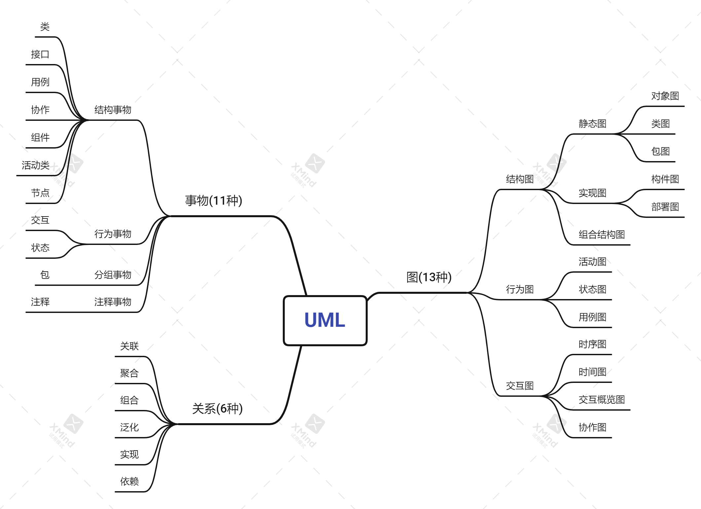

#### 事物

1. 结构事物

   |事物|解释|示例|
   |--|--|--|
   |类Class|具有相同属性、方法、关系和语义的对象集合|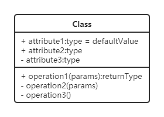|
   |接口Interface|指一个类或构件的一个服务的操作集合，它仅仅定义了一组操作的规范，并没有给出这组操作的具体实现|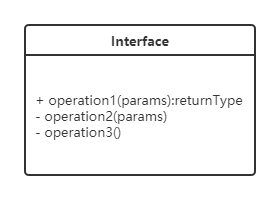|
   |用例UserCase|指对一组动作序列的描述，系统执行这些动作将产生一个对特定的参与者（Actor）有价值且可观察的结果|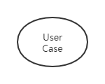|
   |协作Collaboration|定义元素之间的相互作用||
   |组件Component|描述物理系统的一部分|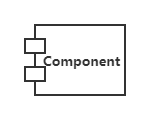|
   |活动类ActiveClass|指对象有一个或多个进程或线程。活动类和类很相象，只是它的对象代表的元素的行为和其他元素是同时存在的|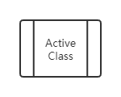|
   |节点Node|定义为运行时存在的物理元素|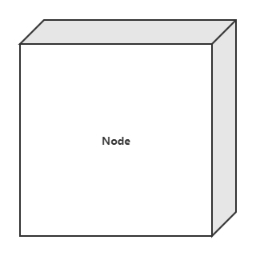|

2. 行为事物
   |事物|解释|示例|
   |--|--|--|
   |交互Interaction|包括一组元素之间的消息交换||
   |状态机StateMachine|由一系列对象的状态组成|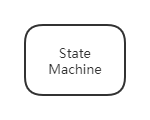|

3. 分组事物
   |事物|解释|示例|
   |--|--|--|
   |包Package|UML中唯一的组织机制|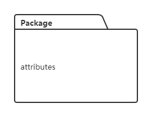|

4. 注释事物
   |事物|解释|示例|
   |--|--|--|
   |注释Note|用于解析说明UML元素|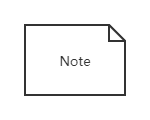|

#### 图

|图名称|解释|
|--|--|
|类图(Class Diagrams)|用于定义系统中的类|
|对象图(Object Diagrams)|类图的一个实例，描述了系统在具体时间点上所包含的对象及各个对象之间的关系|
|构件图(Component Diagrams)|一种特殊的 UML 图，描述系统的静态实现视图|
|部署图(Deployment Diagrams)|定义系统中软硬件的物理体系结构|
|活动图(Activity Diagrams)|用来描述满足用例要求所要进行的活动及活动间的约束关系|
|状态图(State Chart Diagrams)|用来描述类的对象的所有可能的状态和时间发生时，状态的转移条件|
|用例图(Usecase Diagrams)|用来描述用户的需求，从用户的角度描述系统的功能，并指出各功能的执行者，强调谁在使用系统、系统为执行者完成哪些功能|
|时序图(Sequence Diagrams)|描述对象之间的交互顺序，着重体现对象间消息传递的时间顺序，强调对象之间消息的发送顺序，同时显示对象之间的交互过程|
|协作图(Collaboration Diagrams)|描述对象之间的合作关系，更侧重向用户对象说明哪些对象有消息的传递|
|包图(Package Diagrams)|对构成系统的模型元素进行分组整理的图|
|组合结构图(Composite Structure Diagrams)|表示类或者构建内部结构的图|
|时间图(Timing Diagrams)|用来显示随时间变化，一个或多个元素的值或状态的更改，也显示时间控制事件之间的交互及管理它们的时间和期限约束|
|交互概览图(Interaction Overview Diagrams)|用活动图来表示多个交互之间的控制关系的图|

#### 关系

|分类|解释|表示方式|示例|
|--|--|--|--|
|依赖(Dependency)|一种使用关系，某个类的方法通过局部变量、方法的参数或者对静态方法的调用来访问另一个类（被依赖类）中的某些方法来完成一些职责|用**带箭头的虚线**表示，箭头从**使用类指向被依赖类**。|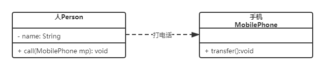|
|关联(Association)|一种引用关系，表示一类对象与另一类对象之间的联系，关联可以是双向的，也可以是单向的|双向的关联用带两个箭头或者没有箭头的**实线**来表示，单向的关联用带一个箭头的实线来表示，箭头从**使用类指向被关联**的类。也可以在关联线的两端标注角色名，代表两种不同的角色。|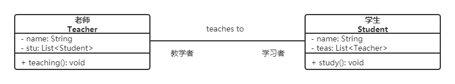|
|聚合(Aggregation)|关联关系中的一种，是强关联关系，是整体和部分之间的关系,has-a关系。|用**带空心菱形的实线**来表示，**菱形指向整体**|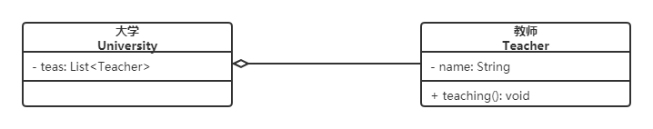|
|组合(Composition)|关联关系中的一种，也是整体和部分之间的关系，是cxmtains-a关系。整体对象可以控制部分对象的生命周期，一旦整体对象不存在，部分对象也将不存在，部分对象不能脱离整体对象而存在。|用**带实心菱形的实线**来表示，**菱形指向整体**。|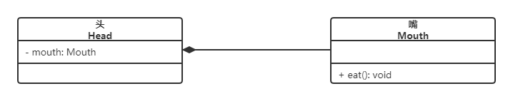|
|泛化(Generalization)|对象之间耦合度最大的一种关系，表示一般与特殊的关系，是父类与子类之间的关系，是一种继承关系，is-a关系。|用**带空心三角箭头的实线**来表示，**箭头从子类指向父类**。|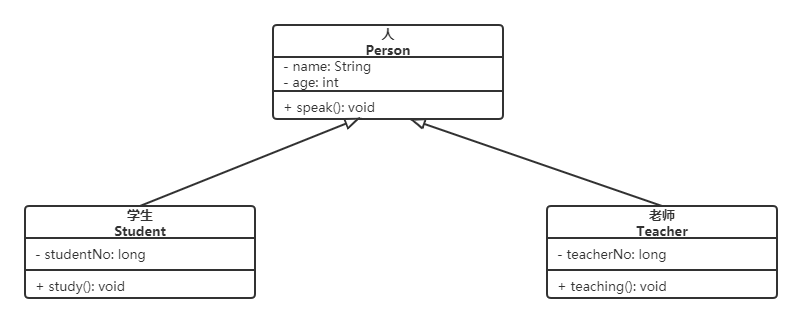|
|实现(Realization)|接口与实现类之间的关系，类实现了接口，类中的操作实现了接口中所声明的所有的抽象操作|用**带空心三角箭头的虚线**来表示，箭头**从实现类指向接口**。|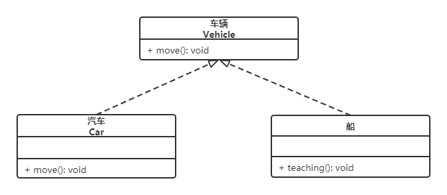|

#### UML cheatsheet

